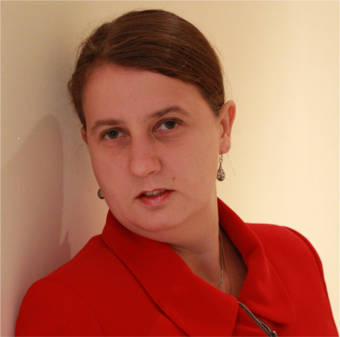

## Keynote Speaker

[Marina De Vos](https://researchportal.bath.ac.uk/en/persons/marina-de-vos/)

Department of Computer Science, University of Bath, UK

### Evolving normative systems: Allowing the system to adapt to changing needs

Bio: Marina De Vos is a Senior Lecturer/Associate Professor in artificial intelligence and director of training for the UKRI Centre for Doctoral Training in Accountable, Responsible and Transparent AI at the University of Bath.  Marina's research interests lie in automated human reasoning to allow better access to specialist knowledge, explainable artificial intelligence methods and modelling the behaviour of autonomous systems. Some application areas of her work are normative systems, legal reasoning, automated music composition and assessing building damage after earthquakes. 

In her work on normative multi-agent systems in the field of COINE, Marina currently explores systems that can automatically evolve through both external and internal stimuli and different ways of explaining the (normative) decisions by agents. Recently. she started looking at how to combine normative and value-based systems. She has twice had the privilege of serving as a COINE programme chair. 
